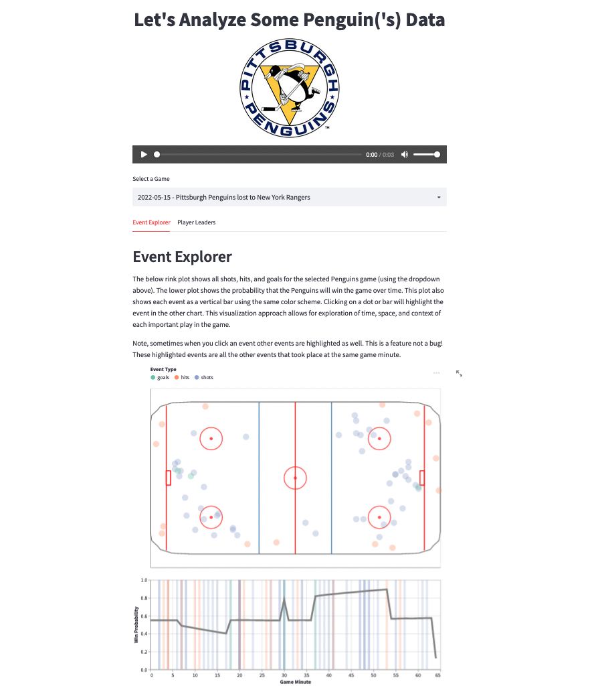

# Penguins NHL Game Explorer

"It's a hockey night in Pittsburgh!" -Mike Lang (Longtime Pittsburgh Penguins Radio Announcer)

Mike's words ring true as the first night of 2022 hockey season corresponds with the due date of this assignment!  Inspired by the beginning of my favorite sports season, I decided to create an app that addresses a gap in the sports visualization space.  While there are no shortage of high-quality hockey visualizations, I have not encountered a visualization that comprehensively answers the age-old sports question, "What happened in that game?."  Specifically, existing visualizations allow exploration of game events over time and over space, but not both.  Moreover, these existing projects ignore game context.  This app attempts to allow easy user exploration over all of these dimensions using a unique visualization combined with a model to generate in-game win probabilities.

## Project Goals

The goal of this project is to provide an interactive visualization to explore the main events in an NHL game.  Specifically, users can see how each event affects the overall win probability as well the rink location where the event occurred.  

Exploring a data with this application could be used by fans to gain a better understanding of how their team is performing, but the main intended audience for the app is coaching staffs. I have worked with the United States Military Academy's hockey team on some analytic studies and the coaching staff is always asking for aids to help them better understand what happened in a game.  This app is a step towards an improved level of situational awareness.  

While I used a fairly simplistic logistic regression win probability model here (more on this below), the app framework provides a compelling way to explore improved models along with  important features.  This concept could also have generalized applicability to other time series-based machine learning models outside of the sports world.

Finally, this app provides a useful starting point for future analysis.  I will discuss many potential follow-on studies that this project enables in the final section of this write-up.

## Design

I found myself heavily constrained by the things that are possible in Streamlit and Altair.  I fought these constraints for the rink plot, but they were very influential on most of my design decisions.  With that said, I recognize that there is a trade-off here.  As discussed below, the development process was fairly easy - but that is only when I used features that are supported by Streamlit and Altair.

One of the biggest design constraints that affected my app was the inability to pass data from Altair plots back to python or to other Streamlit components.  For example, I had to implement the filtering between the rink plot and the win probability plot using Altair alone.  It would have been much easier to pass the clicked selection from one plot to a Streamlit drop down and then use that drop down to filter the other plots.  This would allow for much more robust interactions.

One of the key design decisions that I made was to use consistent colors to denote the different event types across all of the visualizations.  This allowed for more seamless visual integration of the rink plot dots with the bars on the win probability plot.  I used the same color schemes in the "Player Leaders" tab as well.  

Something that I considered but did not implement was an option to hide all of the bars in the win probability plot and allow filtering by selecting a game minute.  I attempted to implement this but was unable to get a brushing filter to work with the select filter I wanted to keep on the rink plot.  Moreover, I think the colored bars are a useful visual guide to the event types in relation to the win probabilities.

## Development

I worked on this assignment alone with permission from the instructor group on Piazza due to some personal obstacles (thank you!).  I estimate the entire project took roughly 10 hours to complete with time roughly evenly split between data acquisition/cleaning and app development.  The vast majority of the app development time was spent on the rink/win probability linked plots.  The Altair process to link plots is not intuitive, so this took a lot of time and effort.

The data used in this app is directly pulled from the NHL's undocumented API (https://gitlab.com/dword4/nhlapi) and parsed into data structures that work nicely with Altair.  Acquiring and cleaning this data was time consuming, but ultimately not that difficult.  The entire process is provided in a python file in the project's main directory.

I found working with Streamlit Cloud through Github to be a very effective development process.  I did not run into anything especially strange or challenging when trying to deploy or update the app.  

## Success Story

The biggest success story in this project was generating the rink.  It still looks imperfect, but I was seriously doubting whether or not it would even be possible to layer all of these things together into a single Altair plot while maintaining the linked interaction between the rink and the win probability plot.  I think having the rink plot adds a lot to the visual effectiveness of the app.

In other visualization languages, it seems people who are displaying sports events usually add a picture of a rink (or field, etc.) as the background, then they layer points on top.  Altair does not support image backgrounds for their plots, so I had to specify x-y coordinates to manually draw all of the rink shapes.

The corner boards are imperfect and are clearly made by straight lines, but I do not think this detracts significantly from the final product.  This is clearly an abstraction of a hockey rink and the major landmarks (e.g., the goals) are easy to find.

## Future Work

Perhaps the easiest thing to do next would be to improve the resolution of the rink drawing to round out the corner boards to some degree.

This work could also be expanded to all NHL teams instead of just the Penguins, and it would even be possible to link the app directly to the NHL's API to provide a view for live games.

Another useful future focus area would be to add different event types.  For example, I did not address penalties which could be a useful feature in the win probability model (e.g., taking lots of penalties is likely associated with losing).  This work could even be expanded to include events from opposing teams as well (not just differentials).

Finally, the biggest area of potential improvement is the win probability model.  The model used in this paper is very simplistic and the only really important feature is the goal differential interacted with game time.  My understanding is most win probability models used for sites like ESPN attempt to predict the final score (regression) instead of predicting win vs. loss (classification).  Perhaps the biggest limiting factor to improved modeling, however, is the available feature set.  We are limited by what the NHL API provides and there are some big gaps.  For example, there is no passing data.  Even with these data shortcomings, it would be interesting to try to improve model performance.  

